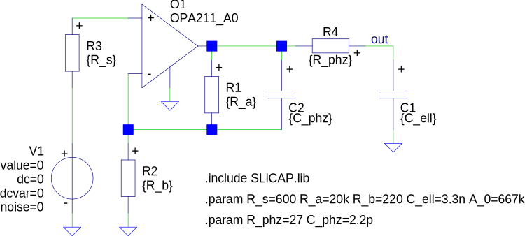

======================================
My first voltage amplifier compensated
======================================

Circuit diagram
===============

Netlist
=======

.. include:: ../SLiCAPdata/myFirstVampOPA211compensated_netlist.rst

Expanded netlist
================

The expanded netlist is shown in :numref:`table-elementData`.

.. include:: ../SLiCAPdata/myFirstVampOPA211compensated_elementData.rst

Parameter definitions
=====================

.. include:: ../SLiCAPdata/myFirstVampOPA211compensated_parDefs.rst

Undefined parameters
====================

.. include:: ../SLiCAPdata/myFirstVampOPA211compensated_params.rst

Asymptotic-gain feedback model parameters
=========================================

.. include:: ../SLiCAPdata/myFirstVampOPA211compensated_gain.rst

.. include:: ../SLiCAPdata/myFirstVampOPA211compensated_asymptotic.rst

.. include:: ../SLiCAPdata/myFirstVampOPA211compensated_loopgain.rst

.. include:: ../SLiCAPdata/myFirstVampOPA211compensated_servo.rst

.. include:: ../SLiCAPdata/myFirstVampOPA211compensated_direct.rst

Matrix equation gain
====================

.. include:: ../SLiCAPdata/myFirstVampOPA211compensated_matrices.rst

Asymptotic-gain feedback model plots
====================================

.. image:: ../../img/magComp.svg
    :width: 600px

.. image:: ../../img/phaseComp.svg
    :width: 600px

Poles and zeros
===============

.. include:: ../SLiCAPdata/myFirstVampOPA211compensated_gainPZ.rst

Root locus plot
===============

.. image:: ../../img/RLcomp.svg
    :width: 600px

Unit step response
==================

.. image:: ../../img/stepComp.svg
